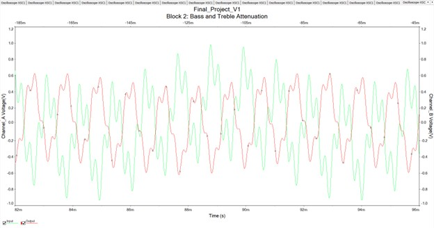

# Karaoke / Mixer Audio Device 🎶

**Course:** EE 210 – Spring 2025  
**Author:** Sadid Hassan  

> ⚡ **Note:** This README is a condensed version of my full course project report.  
> It highlights the design, simulation, and implementation of each block with figures.  
> For in-depth theory, derivations, and detailed calculations, please see the  
> [📄 Full Project Report (PDF)](docs/FinalReport.docx).

This project implements a **tone-control karaoke/mixer system** with real-time **volume, bass, and treble adjustment**, designed and simulated in **Multisim**, laid out in **Ultiboard**, and implemented on both **breadboard and PCB**.

---

## 📝 Overview
The system consists of five blocks:
1. **Mixer / Karaoke** – Combines or subtracts left/right audio inputs.  
2. **Tone Control** – Baxandall circuit for bass and treble adjustment.  
3. **Volume Control** – Potentiometer-based voltage divider.  
4. **Volume Display** – LED comparator circuit showing volume levels.  
5. **Attenuator & Output Buffer** – Prepares output for headphones/audio devices.  

Each block was designed, simulated, and tested individually, then integrated into a complete system.

---

## 🔧 Tools & Equipment
- **Software:** Multisim, Ultiboard  
- **Lab Tools:** NI MyDAQ, NI ELVISmx, Oscilloscope, DMM, Power Supply  
- **Hardware:** Op-amps, potentiometers, resistors, capacitors, SPDT switch, LEDs, breadboard, PCB  

---

## 📐 Block Designs

### Block 1: Mixer / Karaoke
- Implements both a **summing amplifier** (mixing mode) and **subtracting amplifier** (karaoke mode).  
- Switch determines operation:  
  - Mixer: `–(L+R)`  
  - Karaoke: `L – R`  

**Schematic**  
  

**Simulation Results**  
- Mixer Mode  
    
- Karaoke Mode  
    

---

### Block 2: Tone Control
- Baxandall tone-control circuit for bass/treble adjustment.  
- RC filters allow user to boost or attenuate low and high frequencies.  

**Schematic**  
  

**Simulation Results**  
- Bass Boost  
    
- Treble Boost  
    
- Bass & Treble Attenuation  
    

---

### Block 3: Volume Control
- 100kΩ potentiometer as a **voltage divider**.  
- Provides smooth control from **0 → max volume**.  

**Schematic**  
  

**Simulation Result**  
  

---

### Block 4: Volume Display
- Uses **comparator op-amps** with resistor ladder reference voltages.  
- Four LEDs light at different thresholds (0.25V, 0.5V, 1.0V, 1.5V).  

**Schematic**  
  

**Simulation Result**  
  

---

### Block 5: Attenuator & Output Buffer
- Inverting op-amp stage reduces amplitude to **0.5–1V range**.  
- Prepares signal for **headphones or audio jacks**.  

**Schematic**  
  

**Simulation Result**  
  

---

## 🛠️ Implementation

**Breadboard Build**  
  

**PCB Build**  
  

**Complete Circuit Schematic**  
  

---

## ✅ Results & Conclusion
- Successfully built a **fully functional karaoke/mixer system** with bass, treble, volume, and LED display.  
- Learned practical applications of **op-amps, RC filters, comparators, and PCB design**.  
- Debugged issues such as grounding errors and LED activation thresholds, improving troubleshooting skills.  
- Project required integration of concepts from across the semester, reinforcing **circuit design, simulation, and system validation**.  

---

